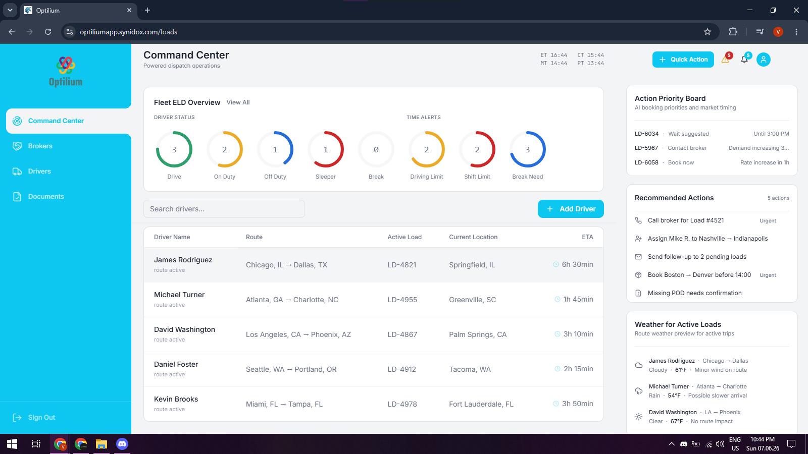
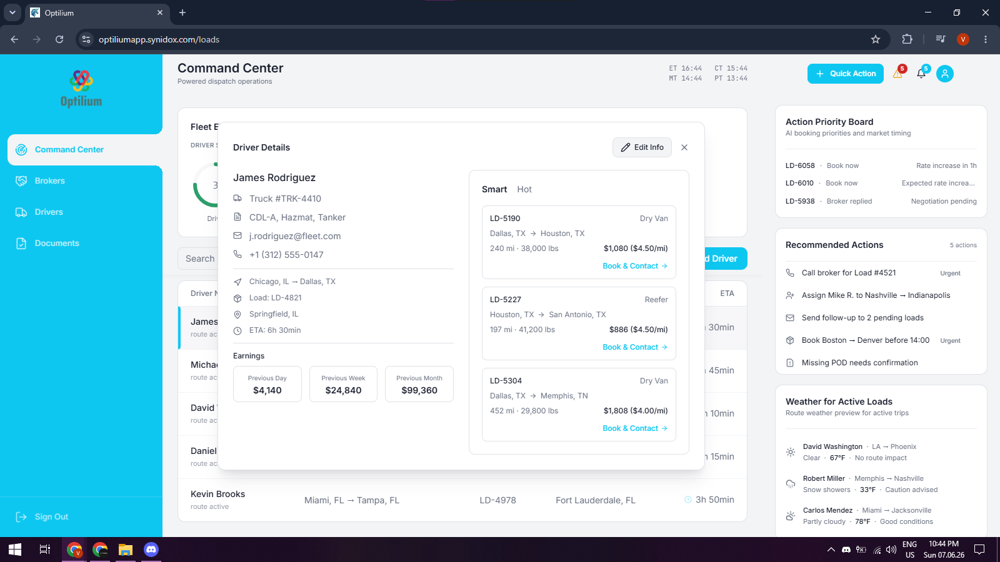
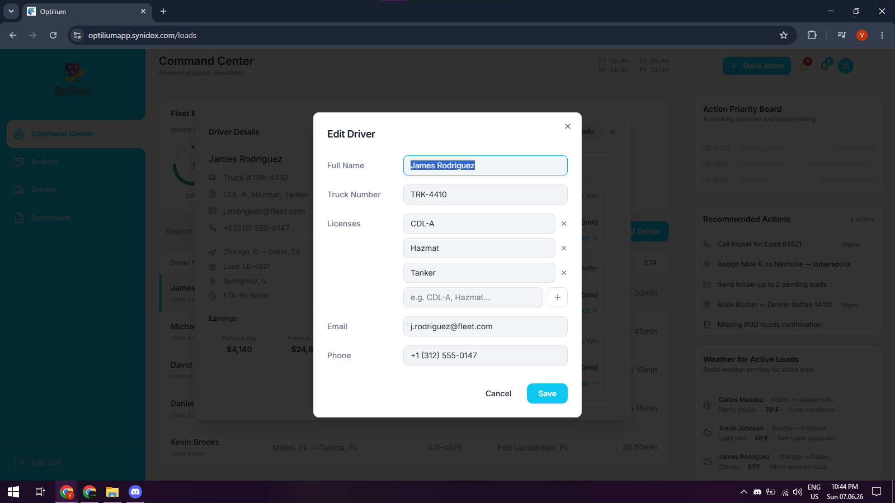
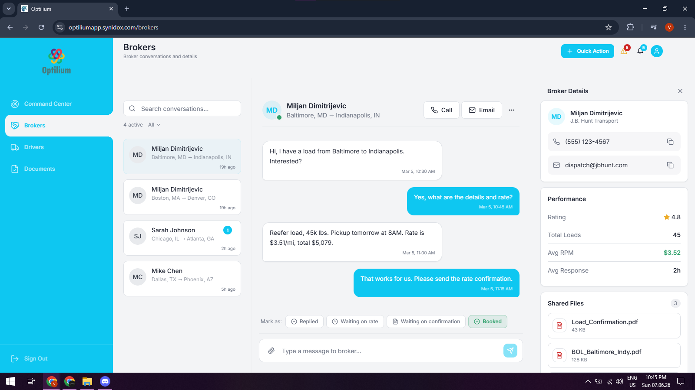
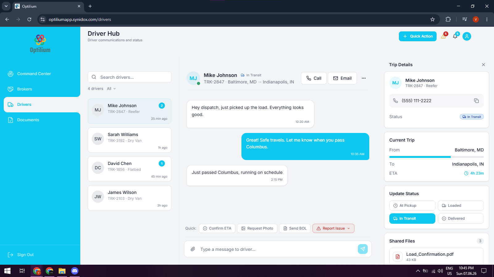
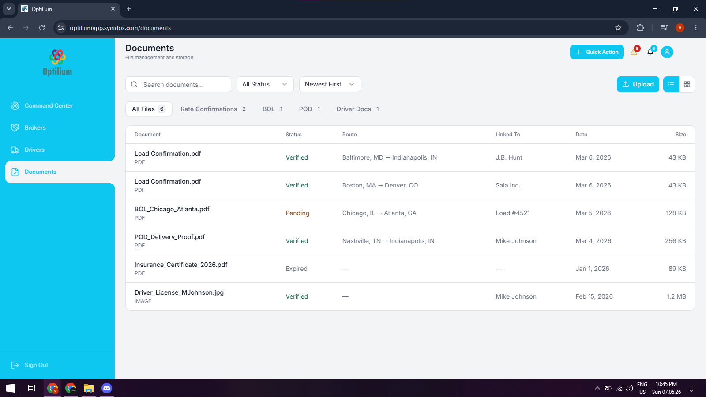

# Optilium

Trucking operations platform designed to streamline dispatch workflows, broker communication, driver management and load operations.

## Overview

Optilium is a modern SaaS platform built for trucking companies and dispatch teams, providing operational visibility, communication workflows and load management tools in a unified interface.

The platform focuses on improving dispatch efficiency, driver coordination and booking operations while reducing manual administrative work.

## Core Features

### Command Center
- Fleet status overview
- Driver activity tracking
- Operational alerts
- Action priority board
- Recommended dispatch actions
- Weather insights

### Driver Management
- Driver profiles
- Route tracking
- ETA monitoring
- Status updates
- Driver communication hub

### Broker Management
- Broker conversations
- Booking negotiations
- Contact management
- Communication history

### Load Operations
- Load assignment workflows
- Smart load recommendations
- Hot load opportunities
- Dispatch coordination

### Document Management
- Rate confirmations
- Bills of Lading (BOL)
- Proof of Delivery (POD)
- Driver documentation

## Tech Stack

### Frontend
- React
- TypeScript
- Vite
- Tailwind CSS
- React Query
- React Router

### Backend
- NestJS
- PostgreSQL
- Prisma
- Redis

## Status

🚧 Active Development

Frontend is functional and deployed.

Backend services are currently being expanded and integrated.

## Live Demo

https://optiliumapp.synidox.com
## Screenshots

### Command Center

### Driver Details

### Hot Load Recommendations

### Action Priority Board

### Broker Hub

### Driver Hub

